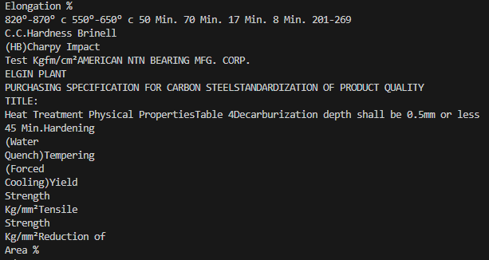

## 기존 구현 방식

### Product 구조도
___

___
## 문서 전처리 및 저장
### 기본 텍스트 추출
pypdf를 이용한 .pdf file Text 추출
이외의 형식(.xlsx, .word)의 경우에는 unstructuredio를 통해 Text 추출

### 문제점

두 사진은 각각 문서 원본과 pypdf 라이브러리를 이용한 텍스트 추출 결과이다. 사진처럼, 정형화되지 않은 pdf에서 테이블 인식 및 텍스트 추출 정확도가 낮음을 확인할 수 있었다.
해결 방법은 후술할 cv 모델을 통한 텍스트 추출 - 대치 알고리즘을 구현해 테이블 구조 인식 문제를 해결하였다.
___
### 테이블 인식을 통한 텍스트 추출 및 내용 대체 알고리즘

1. 테이블 인식 및 Parsing 
	- [UnstructuredIO](https://unstructured.io/) 라이브러리를 활용하여 문서 내의 Element들을 Parsing한다(자세한 사용 예제는 `PDFProcess.py` 참조). \사용한 모델은 해당 라이브러리에 학습된 문서 구조 인식 및 추출에 특화된 YOLOX quantized 모델을 사용하였다
	- Parsing된 Element들 중에서 Table로 인식 된 Element들만을 추출한다
2. 텍스트 변환
	- 인식된 테이블 요소들은 GPT-3.5 Turbo Instruct 모델을 활용하여 HTML 구조에서 딕셔너리 형태로 변경 후 저장한다
	- 효율적인 데이터 사용 및 처리를 위함
3. 텍스트 대치 및 활용
	- 추출 및 변환된 텍스트를 별도의 알고리즘에 따라 교체한다
	- 알고리즘은 Unstructured를 통해 추출된 text를 pypdf 등 기존의 라이브러리에서 추출된 텍스트로 구역을 정해 대치하는 방식이다.
	- 아이디어는 pdf 라이브러리들을 이용해서 텍스트를 추출할  때, 단어 혹은 문장의 position만 바뀌고 전체 Element들의 순서는 동일하게 유지되기 때문에
	- 전체 문서에서 Table 내용들이 들어있는 곳의 맨 앞과 맨 뒤를 지정해서 해당하는 구간만 바꿔주면 된다고 생각했고, 실제로 동작했다. 세부 동작 과정은 다음과 같다.
	
	#### 텍스트 대치 알고리즘

	1. \\n\\n 단위로 구분된 테이블의 각각의 텍스트들을, 해당하는 page에서 어디에 위치하는지 rfind() method를 통해 position을 찾는다. 
	2. start_pos는 초기값을 len(text)로 설정해, 텍스트의 끝으로 초기에 설정한다. 찾은 각 위치가 start_pos보다 작으면 그 위치로 업데이트 한다. 결론적으로 start_pos는 테이블 데이터가 원본 텍스트 내에서 처음으로 나타나는 위치가 된다.
	3. end_pos는 초기값을 -1로 설정해, 유효한 값이 없도록 한다. 찾은 위치가 end_pos보다 클 때, end_pos를 해당 값으로 설정한다. 결론적으로 end_pos는 테이블 데이터가 원본 텍스트 내에서 마지막으로 나타나는 위치의 끝이 된다.
	4. 그렇게 되면 start_pos, end_pos가 초기값이 아니라면 Page에서 특정 구간을 가리킬 수 있는데, 이를 2. 과정에서 생성-저장한 텍스트로 변환한다.

알고리즘을 통해 문서에서 테이블 인식 후 텍스트 추출과 추출된 텍스트를 대체한다.  이는 pypdf, camelot 등 pdf 문서에서 텍스트를 추출하는 라이브러리들의 상대적으로 낮은 Table에 대한 텍스트 추출 정확도를 보완할 수 있다. 
___
### Embedding

전처리된 내용에서 정보를 추출하기 위한 Retrieval Model로서 Sentence Transforemer 기반의 모델 중 2023년 10월 기준으로 MTEB Avg. Score가 상위 5위 이내였던 모델인 [BAAI/bge-base-en-v1.5](https://huggingface.co/BAAI/bge-base-en-v1.5)를 이용하였다.
___
## 검색 및 결과 저장
### Prompting

Retreival를 가능하게 하려면, Relevant document를 Parsing된 문서 내에서 검색할 수 있는 고정적인 Query가 필요했다. 각각 규격서의 상세 내용이 다르더라도, 문맥에 해당하는 내용을 찾기 위해 `qr_dic.json`에 저장된 대로 Category : Definition 형식의 json으로 기록해 검색 시 해당 내용이 존재한다면 return 할 수 있도록 하였다.
___
### 검색

Retrieval 방식으로는 MMR과 BM25를 3:2로 사용한 Hybrid Search 방식을 사용하였다. 유사도 기반 측정과Keyword Search를 동시에 사용해, 더 나은 결과를 얻을 수 있도록 하였다.
___
### 결과 저장

제공된 결과를 Output parsing을 통해 최종 결과물인 `.xlsx` 파일에 저장될 수 있도록, 검색 결과가 존재한다면 전체 결과를 `.csv` 형식으로 임시 저장하도록 하였다.
